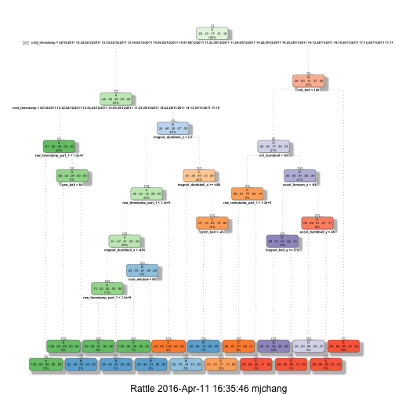
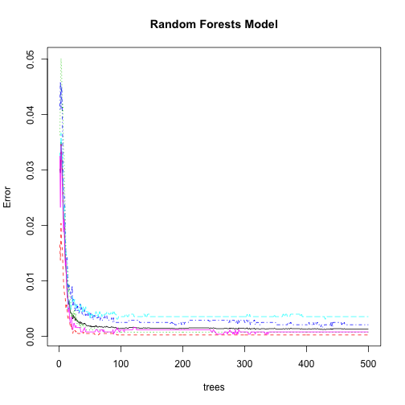

## Project Background
Using devices such as Jawbone Up, Nike FuelBand, and Fitbit it is now possible to collect a large amount of data about personal activity relatively inexpensively. These type of devices are part of the quantified self movement - a group of enthusiasts who take measurements about themselves regularly to improve their health, to find patterns in their behavior, or because they are tech geeks. One thing that people regularly do is quantify how much of a particular activity they do, but they rarely quantify how well they do it. In this project, your goal will be to use data from accelerometers on the belt, forearm, arm, and dumbell of 6 participants. They were asked to perform barbell lifts correctly and incorrectly in 5 different ways. More information is available from the website here: http://groupware.les.inf.puc-rio.br/har (see the section on the Weight Lifting Exercise Dataset).

## Objective
The objective of this project is to predict the manner of performing unilateral dumbbell biceps curls based on data from accelerometers on the belt, forearm, arm, and dumbell of 6 participants. The 5 possible methods include -

* Class A: exactly according to the specification
* Class B: throwing the elbows to the front
* Class C: lifting the dumbbell only halfway
* Class D: lowering the dumbbell only halfway
* Class E: throwing the hips to the front

## Data Preparation
### Require Packages


### Dowloading Files


```r
urlTraining <- "https://d396qusza40orc.cloudfront.net/predmachlearn/pml-training.csv"
fileTraining <- "pml-training.csv"
download.file(url = urlTraining, destfile=fileTraining, method="curl")
urlTesting <- "https://d396qusza40orc.cloudfront.net/predmachlearn/pml-testing.csv"
fileTesting <- "pml-testing.csv"
download.file(url = urlTesting, destfile = fileTesting, method = "curl")
```

### Loading Data
In this step, "NA"", "" and "#DIV/0!" are treated as NA when data is loaded for further process

```r
dataTraining <- read.csv(fileTraining, na.strings = c("NA","","#DIV/0!"), header = TRUE)
colTraining <- colnames(dataTraining)
dataTesting <- read.csv(fileTesting, na.strings = c("NA","","#DIV/0!"), header = TRUE)
colTesting <- colnames(dataTesting)
```
Invenstigate data dimension

```r
dim(dataTraining)
```

```
## [1] 19622   160
```

```r
dim(dataTesting)
```

```
## [1]  20 160
```
There are 19622 observations and 160 variables in training dataset `dataTrainig`, while there are 20 observations and 160 variables in tsest dataset `dataTesting`. The "classe" variable in the training set is the outcome to predict.

### Data Partitioning
To estimate the out-of-sample error, the full training data is partitioned into a smaller training set (pTraining) and a validation set (pTesting):

```r
inTrain <- createDataPartition(dataTraining$classe, p=0.7, list=FALSE)
pTraining <- dataTraining[inTrain, ]
pTesting <- dataTraining[-inTrain, ]
dim(pTraining); 
```

```
## [1] 13737   160
```

```r
dim(pTesting);
```

```
## [1] 5885  160
```

### Data Cleansing
In previous step, NA values are identified and converted.Since they are not necessary for prediction, they can be removed.

```r
pTraining <- pTraining[, colSums(is.na(pTraining)) == 0] 
pTesting <- pTesting[, colSums(is.na(pTesting)) == 0]
```

Except excluding NA values, it is also important to identify variables with near zero variance

```r
nz <- nearZeroVar(pTraining, saveMetrics=TRUE)
subset(nz, zeroVar == TRUE | nzv == TRUE)
```

```
##            freqRatio percentUnique zeroVar  nzv
## new_window  45.40878    0.01455922   FALSE TRUE
```
Variable `new_window` is identify as near zero variance hence it can be removed

```r
pTraining <- pTraining[, nz$nzv == FALSE]
pTesting <- pTesting[, nz$nzv == FALSE]
```
Remove the first column of the `pTraining` data set

```r
pTraining <- pTraining[c(-1)]
pTesting <- pTesting[c(-1)]
```

The number of variables has dropped from 162 to 58.

```r
colnames(pTraining)
```

```
##  [1] "user_name"            "raw_timestamp_part_1" "raw_timestamp_part_2"
##  [4] "cvtd_timestamp"       "num_window"           "roll_belt"           
##  [7] "pitch_belt"           "yaw_belt"             "total_accel_belt"    
## [10] "gyros_belt_x"         "gyros_belt_y"         "gyros_belt_z"        
## [13] "accel_belt_x"         "accel_belt_y"         "accel_belt_z"        
## [16] "magnet_belt_x"        "magnet_belt_y"        "magnet_belt_z"       
## [19] "roll_arm"             "pitch_arm"            "yaw_arm"             
## [22] "total_accel_arm"      "gyros_arm_x"          "gyros_arm_y"         
## [25] "gyros_arm_z"          "accel_arm_x"          "accel_arm_y"         
## [28] "accel_arm_z"          "magnet_arm_x"         "magnet_arm_y"        
## [31] "magnet_arm_z"         "roll_dumbbell"        "pitch_dumbbell"      
## [34] "yaw_dumbbell"         "total_accel_dumbbell" "gyros_dumbbell_x"    
## [37] "gyros_dumbbell_y"     "gyros_dumbbell_z"     "accel_dumbbell_x"    
## [40] "accel_dumbbell_y"     "accel_dumbbell_z"     "magnet_dumbbell_x"   
## [43] "magnet_dumbbell_y"    "magnet_dumbbell_z"    "roll_forearm"        
## [46] "pitch_forearm"        "yaw_forearm"          "total_accel_forearm" 
## [49] "gyros_forearm_x"      "gyros_forearm_y"      "gyros_forearm_z"     
## [52] "accel_forearm_x"      "accel_forearm_y"      "accel_forearm_z"     
## [55] "magnet_forearm_x"     "magnet_forearm_y"     "magnet_forearm_z"    
## [58] "classe"
```
Remove the last column from `dataTesting` dataset

```r
colTraining <- colnames(pTraining)
dataTesting <- dataTesting[colnames(pTraining[, -58])]
```

To assure type of predictors in new data match that of the training data, it is required to coerce the data into the same type.

```r
# Coerce data
for (i in 1:length(dataTesting) ) {
        for(j in 1:length(pTraining)) {
                if( length( grep(names(pTraining[i]), names(dataTesting)[j]) ) == 1)  {
                        class(dataTesting[j]) <- class(pTraining[i])
                }      
        }      
}

dataTesting <- rbind(pTraining[2, -58] , dataTesting)  
dataTesting <- dataTesting[-1,]
```

## Model Selection
In terms of model selection, I use Regression Trees and Random Forests as prediction models and will compare their accuracy to decide which one is chosen.

### Regression Tree

```r
set.seed(1234)
fitRT <- rpart(classe ~ ., data = pTraining, method = "class")
fancyRpartPlot(fitRT)
```

 

```r
predRT <- predict(fitRT, pTesting, type = "class")
cmRT <- confusionMatrix(predRT, pTesting$classe)
cmRT
```

```
## Confusion Matrix and Statistics
## 
##           Reference
## Prediction    A    B    C    D    E
##          A 1614   43    6    3    0
##          B   50  986  124   49    0
##          C   10  102  883  146    1
##          D    0    8   13  722  142
##          E    0    0    0   44  939
## 
## Overall Statistics
##                                           
##                Accuracy : 0.8741          
##                  95% CI : (0.8653, 0.8825)
##     No Information Rate : 0.2845          
##     P-Value [Acc > NIR] : < 2.2e-16       
##                                           
##                   Kappa : 0.8407          
##  Mcnemar's Test P-Value : NA              
## 
## Statistics by Class:
## 
##                      Class: A Class: B Class: C Class: D Class: E
## Sensitivity            0.9642   0.8657   0.8606   0.7490   0.8678
## Specificity            0.9877   0.9530   0.9467   0.9669   0.9908
## Pos Pred Value         0.9688   0.8156   0.7732   0.8158   0.9552
## Neg Pred Value         0.9858   0.9673   0.9699   0.9516   0.9708
## Prevalence             0.2845   0.1935   0.1743   0.1638   0.1839
## Detection Rate         0.2743   0.1675   0.1500   0.1227   0.1596
## Detection Prevalence   0.2831   0.2054   0.1941   0.1504   0.1670
## Balanced Accuracy      0.9759   0.9093   0.9037   0.8579   0.9293
```

The prediction result shows the accuracy is

```r
round(cmRT$overall['Accuracy'], 4)
```

```
## Accuracy 
##   0.8741
```
And the out of sample error is

```r
round(1 - as.numeric(cmRT$overall[1]), 4)
```

```
## [1] 0.1259
```

### Random Forests

```r
set.seed(1234)
fitRF <- randomForest(classe ~ ., data = pTraining)
plot(fitRF, main = "Random Forests Model")
```

 

```r
predRF <- predict(fitRF, pTesting, type = "class")
cmRF <- confusionMatrix(predRF, pTesting$classe)
cmRF
```

```
## Confusion Matrix and Statistics
## 
##           Reference
## Prediction    A    B    C    D    E
##          A 1673    0    0    0    0
##          B    1 1139    2    0    0
##          C    0    0 1024    1    0
##          D    0    0    0  962    1
##          E    0    0    0    1 1081
## 
## Overall Statistics
##                                           
##                Accuracy : 0.999           
##                  95% CI : (0.9978, 0.9996)
##     No Information Rate : 0.2845          
##     P-Value [Acc > NIR] : < 2.2e-16       
##                                           
##                   Kappa : 0.9987          
##  Mcnemar's Test P-Value : NA              
## 
## Statistics by Class:
## 
##                      Class: A Class: B Class: C Class: D Class: E
## Sensitivity            0.9994   1.0000   0.9981   0.9979   0.9991
## Specificity            1.0000   0.9994   0.9998   0.9998   0.9998
## Pos Pred Value         1.0000   0.9974   0.9990   0.9990   0.9991
## Neg Pred Value         0.9998   1.0000   0.9996   0.9996   0.9998
## Prevalence             0.2845   0.1935   0.1743   0.1638   0.1839
## Detection Rate         0.2843   0.1935   0.1740   0.1635   0.1837
## Detection Prevalence   0.2843   0.1941   0.1742   0.1636   0.1839
## Balanced Accuracy      0.9997   0.9997   0.9989   0.9989   0.9994
```
The prediction result shows the accuracy is

```r
round(cmRF$overall['Accuracy'], 4)
```

```
## Accuracy 
##    0.999
```
And the out of sample error is

```r
round(1 - as.numeric(cmRF$overall[1]), 4)
```

```
## [1] 0.001
```

## Conclusion
According the results, Random Forests gives the better accuracy, hence the test cases will be run against Random Forests algorithm.

```r
predict(fitRF, dataTesting)
```

```
## 22  3  4  5  6  7  8  9 10 11 12 13 14 15 16 17 18 19 20 21 
##  B  A  B  A  A  E  D  B  A  A  B  C  B  A  E  E  A  B  B  B 
## Levels: A B C D E
```
